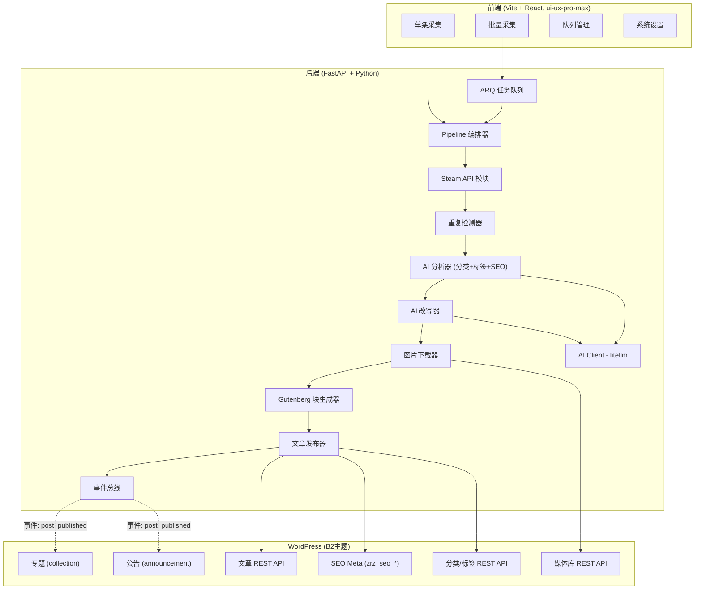
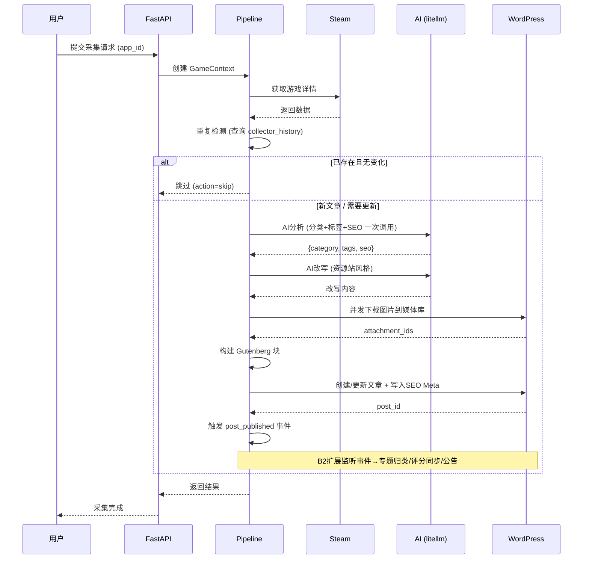

# Steam游戏数据采集工具 - 架构设计文档

## 1. 项目概述

独立部署的游戏资源采集发布系统。从Steam采集游戏数据，通过AI改写为资源站风格的内容（含破解版/绿色版/全DLC解锁等下载资源描述），自动分类打标签、生成SEO，发布为Gutenberg格式文章到WordPress（B2主题）。

### 核心功能
- **单条采集**：输入游戏名/ID，实时搜索并采集
- **AI内容改写**：改写为资源站风格的游戏介绍
- **AI智能分析**：一次AI调用同时完成分类匹配、标签提取、SEO生成
- **重复检测**：防止重复采集，支持更新已有文章
- **B2主题深度集成**：SEO字段写入、专题自动归类、评分同步、公告发布
- **批量采集**：Excel/CSV导入，ARQ队列异步处理
- **图片本地化**：所有图片并发下载到WordPress媒体库
- **Gutenberg原生格式**：100%兼容WordPress编辑器

### 设计原则
- **Pipeline模式**：每个处理步骤可独立启用/禁用/重排序
- **事件驱动**：B2集成通过事件解耦，核心不依赖B2
- **AI调用最少化**：合并分析请求，控制成本

---

## 2. 系统架构



---

## 3. 技术栈

| 层级 | 技术 | 用途 |
|------|------|------|
| 后端框架 | FastAPI (Python 3.11+) | 异步API、类型安全、自动文档 |
| 任务队列 | ARQ (Redis) | 批量采集后台任务 |
| AI调用 | litellm | 统一OpenAI/Claude/DeepSeek等LLM |
| HTTP客户端 | httpx (async) | Steam API + 图片并发下载 |
| WP集成 | WordPress REST API + Application Passwords | 文章/媒体/分类/meta操作 |
| 数据库 | SQLite (开发) / PostgreSQL (生产) | 队列任务、采集历史 |
| 缓存 | Redis | 任务队列后端 + Steam API响应缓存 |
| 前端 | Vite + React | 独立SPA，遵循ui-ux-pro-max |
| 数据验证 | Pydantic v2 | GameContext等模型 |

---

## 4. Steam API接口

### 4.1 搜索游戏
```
GET https://store.steampowered.com/api/storesearch/
参数: term, cc=CN, l=schinese, pagesize=10
```

### 4.2 获取游戏详情
```
GET https://store.steampowered.com/api/appdetails
参数: appids, cc=CN, l=schinese
```

**关键返回字段**：
```json
{
  "name": "游戏名称",
  "steam_appid": 123456,
  "header_image": "头图URL",
  "screenshots": [{"path_full": "截图URL"}],
  "short_description": "短描述",
  "detailed_description": "详细描述（HTML）",
  "developers": ["开发商"],
  "publishers": ["发行商"],
  "release_date": {"date": "发布日期"},
  "price_overview": {"final_formatted": "价格"},
  "genres": [{"description": "类型"}],
  "categories": [{"description": "特性"}]
}
```

---

## 5. Gutenberg块格式

```html
<!-- wp:heading {"level":1} -->
<h1 class="wp-block-heading">游戏名称 中文版下载</h1>
<!-- /wp:heading -->

<!-- wp:image {"id":123,"sizeSlug":"large","className":"steam-header-image"} -->
<figure class="wp-block-image size-large steam-header-image">
  
</figure>
<!-- /wp:image -->

<!-- wp:paragraph -->
<p><strong>开发商:</strong> XXX | <strong>发行商:</strong> XXX | <strong>发布日期:</strong> XXX</p>
<!-- /wp:paragraph -->

<!-- wp:heading {"level":2} -->
<h2 class="wp-block-heading">游戏介绍</h2>
<!-- /wp:heading -->

<!-- wp:paragraph -->
<p>AI改写后的资源站风格描述内容...</p>
<!-- /wp:paragraph -->

<!-- wp:heading {"level":2} -->
<h2 class="wp-block-heading">游戏截图</h2>
<!-- /wp:heading -->

<!-- wp:gallery {"columns":3,"linkTo":"file"} -->
<figure class="wp-block-gallery has-nested-images columns-3 is-cropped">
  <!-- wp:image {"id":124,"sizeSlug":"large"} -->
  <figure class="wp-block-image size-large"></figure>
  <!-- /wp:image -->
</figure>
<!-- /wp:gallery -->
```

---

## 6. 数据库设计

### 6.1 队列任务表
```sql
CREATE TABLE collector_queue (
    id INTEGER PRIMARY KEY AUTOINCREMENT,
    app_id INTEGER NOT NULL,
    app_name TEXT,
    status TEXT DEFAULT 'pending',  -- pending/processing/completed/failed
    post_id INTEGER,
    action_type TEXT DEFAULT 'create',  -- create/update/skip
    error_message TEXT,
    created_at TIMESTAMP DEFAULT CURRENT_TIMESTAMP,
    updated_at TIMESTAMP
);
CREATE INDEX idx_queue_status ON collector_queue(status);
CREATE INDEX idx_queue_app_id ON collector_queue(app_id);
```

### 6.2 采集历史表
```sql
CREATE TABLE collector_history (
    id INTEGER PRIMARY KEY AUTOINCREMENT,
    app_id INTEGER NOT NULL,
    post_id INTEGER NOT NULL,
    action TEXT NOT NULL,  -- created/updated/skipped
    version_hash TEXT,     -- sha256(name + description + price + screenshots_count)
    collected_data TEXT,   -- 原始JSON
    created_at TIMESTAMP DEFAULT CURRENT_TIMESTAMP,
    UNIQUE(app_id, post_id)
);
CREATE INDEX idx_history_app_id ON collector_history(app_id);
```

**version_hash策略**：对 `name + short_description + price + len(screenshots)` 做 `sha256`，用于检测Steam数据是否有变化。

---

## 7. 采集流程（Pipeline）



---

## 8. 文件结构

```
steam-collector/
├── backend/
│   ├── app/
│   │   ├── main.py                     # FastAPI 入口 + 路由
│   │   ├── config.py                   # 配置管理 (Pydantic Settings)
│   │   ├── core/
│   │   │   ├── pipeline.py             # Pipeline编排器 + Processor协议
│   │   │   ├── context.py              # GameContext Pydantic模型
│   │   │   └── events.py               # 事件总线
│   │   ├── steam/
│   │   │   └── api.py                  # Steam API封装 (httpx async)
│   │   ├── ai/
│   │   │   ├── client.py               # AI Client (litellm封装)
│   │   │   ├── analyzer.py             # AI Analyzer (分类+标签+SEO)
│   │   │   ├── rewriter.py             # AI Rewriter (资源站风格改写)
│   │   │   └── prompts.py              # Prompt模板管理
│   │   ├── processors/                 # 各Pipeline处理器
│   │   │   ├── steam_fetch.py
│   │   │   ├── duplicate_check.py
│   │   │   ├── ai_analyze.py
│   │   │   ├── ai_rewrite.py
│   │   │   ├── image_download.py
│   │   │   ├── content_build.py
│   │   │   └── post_publish.py
│   │   ├── wordpress/
│   │   │   ├── client.py               # WP REST API 封装
│   │   │   ├── post.py                 # 文章创建/更新
│   │   │   ├── media.py                # 媒体上传 (图片去重)
│   │   │   └── seo.py                  # B2 SEO Meta 写入
│   │   ├── queue/
│   │   │   └── manager.py              # ARQ 任务管理
│   │   ├── db/
│   │   │   ├── models.py               # SQLAlchemy/SQLModel 模型
│   │   │   └── database.py             # 数据库连接
│   │   └── extensions/
│   │       └── b2/
│   │           ├── integration.py      # B2事件注册入口
│   │           ├── collection.py       # 专题归类
│   │           ├── rating.py           # 评分同步
│   │           └── announcement.py     # 公告发布
│   ├── requirements.txt
│   └── pyproject.toml
├── frontend/                           # Vite + React
│   ├── src/
│   │   ├── App.jsx
│   │   ├── pages/
│   │   │   ├── SingleCollect.jsx
│   │   │   ├── BatchCollect.jsx
│   │   │   ├── QueueManager.jsx
│   │   │   └── Settings.jsx
│   │   ├── components/
│   │   └── design-system/              # ui-ux-pro-max 生成
│   │       ├── MASTER.md
│   │       └── pages/
│   ├── package.json
│   └── vite.config.js
└── docker-compose.yml                  # Redis + App
```

---

## 9. 核心类设计

### 9.1 GameContext（上下文对象）
```python
from pydantic import BaseModel
from typing import Literal

class SEOData(BaseModel):
    title: str          # ≤60字符
    description: str    # ≤160字符
    keywords: str       # 逗号分隔

class GameContext(BaseModel):
    # 输入
    app_id: int
    steam_data: dict = {}

    # Processor 产出
    rewritten_content: str | None = None
    category_id: int | None = None
    tags: list[str] | None = None
    seo: SEOData | None = None
    image_ids: list[int] | None = None     # WP attachment IDs
    block_content: str | None = None

    # 最终结果
    post_id: int | None = None
    action: Literal["create", "update", "skip"] = "create"
```

### 9.2 Pipeline + Processor
```python
from typing import Protocol, runtime_checkable

@runtime_checkable
class Processor(Protocol):
    async def process(self, ctx: GameContext) -> GameContext: ...
    def supports(self, ctx: GameContext) -> bool: ...

class Pipeline:
    def __init__(self):
        self._processors: list[Processor] = []

    def pipe(self, processor: Processor) -> "Pipeline":
        self._processors.append(processor)
        return self

    async def run(self, ctx: GameContext) -> GameContext:
        for p in self._processors:
            if p.supports(ctx):
                ctx = await p.process(ctx)
                if ctx.action == "skip":
                    break
        return ctx
```

### 9.3 AI Client（统一层）
```python
import litellm

class AIClient:
    def __init__(self, provider: str, api_key: str, model: str):
        self.model = f"{provider}/{model}"
        litellm.api_key = api_key

    async def chat(self, prompt: str, system: str = "", json_mode: bool = False) -> str:
        response = await litellm.acompletion(
            model=self.model,
            messages=[
                {"role": "system", "content": system},
                {"role": "user", "content": prompt}
            ],
            response_format={"type": "json_object"} if json_mode else None
        )
        return response.choices[0].message.content

    def estimate_tokens(self, text: str) -> int:
        return len(text) // 2  # 中文粗估
```

### 9.4 AI Analyzer（合并：分类+标签+SEO）
```python
class AIAnalyzer:
    def __init__(self, ai_client: AIClient):
        self.client = ai_client

    async def analyze(self, game_data: dict, existing_categories: list[str]) -> dict:
        """一次调用返回 {category, tags, seo}"""
        prompt = self._build_prompt(game_data, existing_categories)
        result = await self.client.chat(prompt, json_mode=True)
        return json.loads(result)

    def _build_prompt(self, game_data: dict, categories: list[str]) -> str:
        return ANALYZER_PROMPT_TEMPLATE.format(
            game_name=game_data["name"],
            game_description=game_data.get("short_description", ""),
            developer=", ".join(game_data.get("developers", [])),
            steam_tags=", ".join(game_data.get("genres", [])),
            existing_categories="\n".join(categories)
        )
```

### 9.5 AI Rewriter（资源站风格改写）
```python
class AIRewriter:
    def __init__(self, ai_client: AIClient):
        self.client = ai_client

    async def rewrite(self, game_data: dict, style: str = "resource_site") -> str:
        prompt = self._build_prompt(game_data, style)
        return await self.client.chat(prompt)

    def _build_prompt(self, game_data: dict, style: str) -> str:
        template = REWRITE_TEMPLATES.get(style, REWRITE_TEMPLATES["resource_site"])
        return template.format(
            game_name=game_data["name"],
            original_description=game_data.get("detailed_description", "")
        )
```

### 9.6 WordPress Client（REST API封装）
```python
class WordPressClient:
    def __init__(self, base_url: str, username: str, app_password: str):
        self.base_url = base_url.rstrip("/")
        self.client = httpx.AsyncClient(
            auth=(username, app_password),
            timeout=30.0
        )

    async def create_post(self, title, content, status="draft", meta=None, **kwargs):
        data = {"title": title, "content": content, "status": status}
        if meta:
            data["meta"] = meta
        data.update(kwargs)
        resp = await self.client.post(f"{self.base_url}/wp-json/wp/v2/posts", json=data)
        return resp.json()

    async def upload_media(self, image_bytes, filename, mime_type="image/jpeg"):
        headers = {"Content-Disposition": f'attachment; filename="{filename}"',
                    "Content-Type": mime_type}
        resp = await self.client.post(
            f"{self.base_url}/wp-json/wp/v2/media",
            content=image_bytes, headers=headers
        )
        return resp.json()

    async def set_post_meta(self, post_id: int, meta: dict):
        """写入自定义字段（含B2 SEO字段）"""
        resp = await self.client.post(
            f"{self.base_url}/wp-json/wp/v2/posts/{post_id}",
            json={"meta": meta}
        )
        return resp.json()
```

### 9.7 B2 SEO写入
```python
class B2SEOWriter:
    """基于 b2/Modules/Settings/Seo.php 源码的字段映射"""

    META_KEYS = {
        "title": "zrz_seo_title",
        "keywords": "zrz_seo_keywords",
        "description": "zrz_seo_description",
    }

    async def write_seo(self, wp_client: WordPressClient, post_id: int, seo: SEOData):
        meta = {
            self.META_KEYS["title"]: seo.title,
            self.META_KEYS["keywords"]: seo.keywords,
            self.META_KEYS["description"]: seo.description,
        }
        await wp_client.set_post_meta(post_id, meta)
```

### 9.8 事件总线 + B2扩展
```python
class EventBus:
    def __init__(self):
        self._handlers: dict[str, list] = {}

    def on(self, event: str):
        def decorator(fn):
            self._handlers.setdefault(event, []).append(fn)
            return fn
        return decorator

    async def emit(self, event: str, **kwargs):
        for handler in self._handlers.get(event, []):
            await handler(**kwargs)

# B2扩展注册
event_bus = EventBus()

class B2Integration:
    def __init__(self, wp_client, event_bus):
        self.wp = wp_client
        event_bus.on("post_published")(self.on_post_published)

    async def on_post_published(self, post_id: int, context: GameContext):
        await self._assign_collection(post_id, context)
        await self._sync_rating(post_id, context)
        await self._check_announcement(post_id, context)

    async def _assign_collection(self, post_id, ctx):
        """将游戏归类到B2专题 (collection taxonomy)"""
        # 通过 WP REST API: POST /wp-json/wp/v2/posts/{id} {"collection": [term_id]}
        ...

    async def _sync_rating(self, post_id, ctx):
        """同步Steam评分到文章meta"""
        ...

    async def _check_announcement(self, post_id, ctx):
        """检测限免/大折扣→创建B2公告 (announcement post type)"""
        # meta: b2_gg_show=0, b2_gg_days=1, b2_gg_over=7
        ...
```

### 9.9 Image Downloader（并发 + 去重）
```python
class ImageDownloader:
    def __init__(self, wp_client: WordPressClient):
        self.wp = wp_client

    async def download_all(self, urls: list[str], app_id: int) -> list[int]:
        """并发下载，返回 attachment_id 列表"""
        tasks = [self._download_one(url, app_id, i) for i, url in enumerate(urls)]
        return await asyncio.gather(*tasks)

    async def _download_one(self, url: str, app_id: int, index: int) -> int:
        # URL哈希去重：检查媒体库是否已存在
        url_hash = hashlib.md5(url.encode()).hexdigest()
        existing = await self.wp.search_media(url_hash)
        if existing:
            return existing["id"]

        async with httpx.AsyncClient() as client:
            resp = await client.get(url, timeout=30)
            filename = f"steam_{app_id}_{index}_{url_hash[:8]}.jpg"
            return (await self.wp.upload_media(resp.content, filename))["id"]
```

### 9.10 Queue Manager（ARQ）
```python
from arq import create_pool
from arq.connections import RedisSettings

async def process_game_task(ctx, app_id: int):
    """ARQ worker任务：处理单个游戏采集"""
    pipeline = build_pipeline(ctx["settings"])
    game_ctx = GameContext(app_id=app_id)
    result = await pipeline.run(game_ctx)
    return {"post_id": result.post_id, "action": result.action}

class WorkerSettings:
    functions = [process_game_task]
    redis_settings = RedisSettings()
    max_jobs = 5
    job_timeout = 300  # 5分钟超时
```

---

## 10. 后台界面设计

### 10.0 前端设计系统（ui-ux-pro-max）

**开发前必须执行**：
```bash
python3 skills/ui-ux-pro-max/scripts/search.py \
  "gaming dashboard SaaS tool steam dark" \
  --design-system --persist -p "Steam Collector"
```

各页面 override：
```bash
python3 skills/ui-ux-pro-max/scripts/search.py "data collection form search" \
  --design-system --persist -p "Steam Collector" --page "collect"
python3 skills/ui-ux-pro-max/scripts/search.py "task queue progress monitoring" \
  --design-system --persist -p "Steam Collector" --page "queue"
python3 skills/ui-ux-pro-max/scripts/search.py "settings configuration API" \
  --design-system --persist -p "Steam Collector" --page "settings"
```

**Pre-Delivery Checklist**：
- 无emoji图标，使用Lucide SVG
- 所有可点击元素有cursor-pointer
- hover不导致布局偏移
- 暗色/亮色模式对比度≥4.5:1
- 响应式：375px / 768px / 1024px / 1440px
- 所有图片有alt，表单有label
- `prefers-reduced-motion` 支持

### 10.1 单条采集页面
- 搜索框：输入游戏名，实时搜索
- 搜索结果卡片：头图、游戏名、开发商，点击选择
- 预览面板：
  - 原始描述（可折叠）
  - AI改写预览（资源站风格）
  - AI推荐分类（可手动修改）
  - AI标签列表（可增删）
  - SEO预览：标题/描述/关键词
  - 重复检测提示
- 操作按钮："采集并发布"、"保存草稿"、"重新改写"

### 10.2 批量采集页面
- 文件上传区域（Excel/CSV拖拽上传）
- Pipeline设置面板：
  - 各Processor的启用/禁用开关
  - AI改写风格选择
  - 重复处理策略（跳过/更新/提示）
- 任务统计卡片（待处理/进行中/已完成/失败/已跳过）
- 实时进度条 + 任务列表

### 10.3 设置页面
- **AI配置**：Provider选择、API Key、Model、自定义Prompt
- **WordPress连接**：站点URL、用户名、Application Password、连接测试
- **B2主题设置**：
  - SEO开关检测（读取 `open_seo` 配置）
  - 专题映射规则
  - 公告触发条件
- **采集设置**：Steam API延迟、图片下载并发数、发布状态(草稿/发布)

---

## 11. AI Prompt设计

### 11.1 AI Analyzer Prompt（分类+标签+SEO 一次调用）

```
你是一位专业的游戏资源站编辑。请根据以下游戏信息，完成三项任务，以JSON格式返回结果。

## 任务1：分类匹配
从【给定分类列表】中选择最适合的一个分类。
规则：只能从列表中选择，不能创建新分类。无法匹配时返回"uncategorized"。

## 任务2：标签提取
提取5-8个最相关的关键词作为文章标签。
规则：
- 标签简洁，2-6个字
- 包含资源相关标签（如"PC游戏下载"、"全DLC"、"免安装"、"中文版"）
- 包含游戏类型和玩法标签
- 不包含过于宽泛的词（如"游戏"、"好玩"）

## 任务3：SEO生成
生成适合资源下载站的SEO元数据。
规则：
- SEO标题(≤60字)：格式"{game_name}下载|全DLC+中文版|免安装绿色版"
- Meta描述(≤160字)：包含"下载"、"破解"、"绿色版"等资源站关键词，突出游戏特色
- Focus关键词(3-5个)：包含"{game_name}下载"、"{game_name}破解版"等长尾词

## 游戏信息
游戏名称：{game_name}
游戏描述：{game_description}
开发商：{developer}
Steam标签：{steam_tags}

## 给定分类列表
{existing_categories}

## 返回格式（严格JSON）
{{
  "category": "分类名称",
  "tags": ["标签1", "标签2", ...],
  "seo": {{
    "title": "SEO标题",
    "description": "Meta描述",
    "keywords": "关键词1,关键词2,关键词3"
  }}
}}
```

### 11.2 AI Rewriter Prompt（资源站风格）

```
你是一位专业的游戏资源站编辑。请基于以下Steam游戏介绍，改写一段适合资源下载站发布的游戏推荐文案。

要求：
1. 保留游戏核心玩法和特色
2. 语言流畅，带有资源站推荐风格（如"本站提供XXX中文版下载"、"全DLC解锁"、"免安装绿色版"等）
3. 字数控制在300-500字
4. 适当提及版本信息、语言支持、系统配置要求等实用信息
5. 突出"完整版"、"全DLC"、"中文支持"等用户关心的下载亮点
6. 不要添加标题，直接输出正文

游戏名称：{game_name}
原始介绍：
{original_description}

请输出改写后的内容：
```

### 11.3 改写风格选项

| 风格 | 关键调整 | 适用场景 |
|------|----------|----------|
| resource_site（默认）| 强调下载资源、版本信息、DLC | 资源下载站 |
| review | 深入分析玩法和优缺点 | 评测站 |
| seo_heavy | 高密度关键词，自然嵌入 | SEO导流 |
| brief | 简短概述，突出卖点 | 列表展示 |

### 11.4 SEO模板变量

| 变量 | 说明 | 示例 |
|------|------|------|
| `{game_name}` | 游戏名称 | 艾尔登法环 |
| `{category}` | 分类 | 动作RPG |
| `{developer}` | 开发商 | FromSoftware |
| `{price}` | Steam价格 | ¥298 |
| `{release_date}` | 发布日期 | 2022年2月 |
| `{site_name}` | 网站名称 | 游戏资源站 |

**推荐资源站SEO标题模板**：
- `"{game_name}下载|全DLC中文版|免安装绿色版 - {site_name}"`
- `"{game_name}破解版下载 v最新版 全DLC解锁 - {site_name}"`
- `"{game_name}中文版下载|{category}游戏推荐 - {site_name}"`

---

## 12. B2主题SEO集成（基于源码）

### 12.1 SEO字段映射

来源：`b2/Modules/Settings/Seo.php` + `b2/Modules/Common/Seo.php`

| 用途 | Post Meta Key | 说明 |
|------|---------------|------|
| SEO标题 | `zrz_seo_title` | 为空时B2自动使用文章标题 |
| SEO关键词 | `zrz_seo_keywords` | 为空时B2自动使用文章标签名逗号拼接 |
| SEO描述 | `zrz_seo_description` | 为空时B2自动截取摘要前100字 |

**采集器策略**：主动填充所有字段，不依赖B2降级。

### 12.2 SEO开关检测

```python
# B2主题 open_seo 配置：
# 0 = 使用B2自带SEO → 写入 zrz_seo_* 字段 ✅
# 1 = 关闭B2 SEO（使用Yoast/Rank Math等第三方）
```

### 12.3 B2自动生成的OG标签（无需处理）

B2主题 `Common/Seo.php` 自动输出：
- `og:locale`, `og:type`, `og:site_name`, `og:title`, `og:url`
- `og:image`（特色图 600×400 缩略图）
- `og:updated_time`, `article:author`

### 12.4 B2专题（Collection）

`collection` 是B2自定义taxonomy（`Taxonomies.php` L473-L538）。

```python
# 获取所有专题
GET /wp-json/wp/v2/collection

# 设置文章专题
POST /wp-json/wp/v2/posts/{id}
Body: {"collection": [term_id_1, term_id_2]}
```

### 12.5 B2公告（Announcement）

`announcement` 是B2自定义post type，重要meta字段：

| Meta Key | 类型 | 说明 |
|----------|------|------|
| `b2_gg_show` | int | 0=所有人, 1=登录用户, 2=未登录, 3=不显示 |
| `b2_gg_days` | int | 关闭后再弹出间隔天数（默认1） |
| `b2_gg_over` | int | 过期天数（默认7） |

### 12.6 Term SEO字段

B2为 `category`/`post_tag`/`collection` 等taxonomy也提供SEO设置（`Taxonomies.php`）：

| Term Meta Key | 说明 |
|---------------|------|
| `seo_title` | 分类/标签/专题的SEO标题 |
| `seo_keywords` | 分类/标签/专题的SEO关键词 |

---

## 13. API路由设计

```python
# 单条采集
POST   /api/collect              # 采集单个游戏
POST   /api/collect/preview      # 预览AI改写/分析结果

# Steam搜索
GET    /api/steam/search?q=xxx   # 搜索游戏
GET    /api/steam/app/{app_id}   # 获取游戏详情

# 批量采集
POST   /api/batch/upload         # 上传Excel/CSV
GET    /api/batch/status         # 队列状态统计
GET    /api/batch/tasks          # 任务列表
POST   /api/batch/retry/{id}     # 重试失败任务
POST   /api/batch/pause          # 暂停队列
POST   /api/batch/resume         # 恢复队列

# 设置
GET    /api/settings             # 获取配置
PUT    /api/settings             # 更新配置
POST   /api/settings/test-ai     # 测试AI连接
POST   /api/settings/test-wp     # 测试WP连接

# 历史
GET    /api/history              # 采集历史列表
GET    /api/history/check/{app_id}  # 检查是否已采集
```

---

## 14. 开发计划

| 阶段 | 任务 | 预计时间 |
|------|------|----------|
| 1 | 项目骨架 + 配置管理 + Pipeline框架 | 1天 |
| 2 | Steam API模块 + GameContext | 1天 |
| 3 | AI Client + AI Analyzer (合并分类+标签+SEO) | 2天 |
| 4 | AI Rewriter (资源站风格) + Prompt调试 | 2天 |
| 5 | WordPress Client + B2 SEO写入 | 2天 |
| 6 | 重复检测 + 图片下载(并发+去重) | 1天 |
| 7 | Gutenberg块生成 + Post Creator | 1天 |
| 8 | ARQ批量队列系统 | 2天 |
| 9 | B2扩展(专题/评分/公告) | 1天 |
| 10 | 前端: 设计系统 + 单条采集页 | 2天 |
| 11 | 前端: 批量采集 + 队列管理 + 设置页 | 2天 |
| 12 | 集成测试 + Prompt优化 | 2天 |

**总计**：约 19 天

---

## 15. 注意事项

### 15.1 Steam相关
- **API限制**：批量采集间隔3-5秒，使用Redis缓存响应（TTL 1小时）
- **图片下载**：并发数限制5，超时30秒，失败重试3次
- **图片去重**：URL MD5哈希查询媒体库，避免重复上传

### 15.2 AI相关
- **成本控制**：分类+标签+SEO合并为一次调用（省50%成本），批量预览Token消耗
- **失败降级**：AI失败时使用原始描述，分类使用默认分类
- **审核兜底**：提供预览功能，发布前可人工审核
- **API Key安全**：用环境变量或加密存储，不暴露到前端

### 15.3 B2主题集成
- **SEO字段**：通过WP REST API meta字段写入, 需先在WP注册meta字段为REST可见
- **专题归类**：一个游戏可属于多个专题
- **公告自动发布**：仅在检测到限时免费或大折扣（>50%）时触发
- **评分同步**：写入自定义meta字段，格式与B2主题兼容

### 15.4 WordPress REST API
- **认证方式**：Application Passwords（WP 5.6+原生支持）
- **Meta字段可见性**：B2的 `zrz_seo_*` 字段默认被 `hidden_post_custom_field` 隐藏（`Post.php` L47-51），需要通过 `register_post_meta` 注册为 REST API 可见
- **collection taxonomy**：需确认REST API端点已暴露

### 15.5 部署
- 需要 Redis 实例（ARQ任务队列）
- Python 3.11+ 环境
- 推荐 Docker Compose 部署：App + Redis

---

## 16. Excel/CSV格式要求

```csv
app_id,app_name
730,Counter-Strike 2
570,Dota 2
440,Team Fortress 2
```

- `app_id`：必填，Steam游戏ID
- `app_name`：可选，游戏名称（仅参考）
